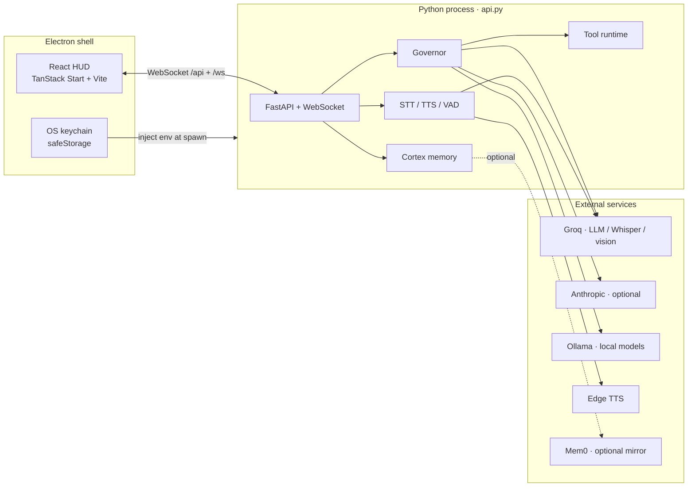
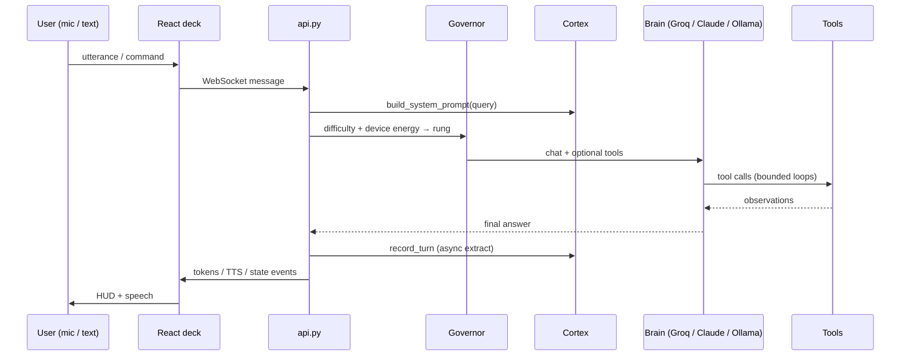
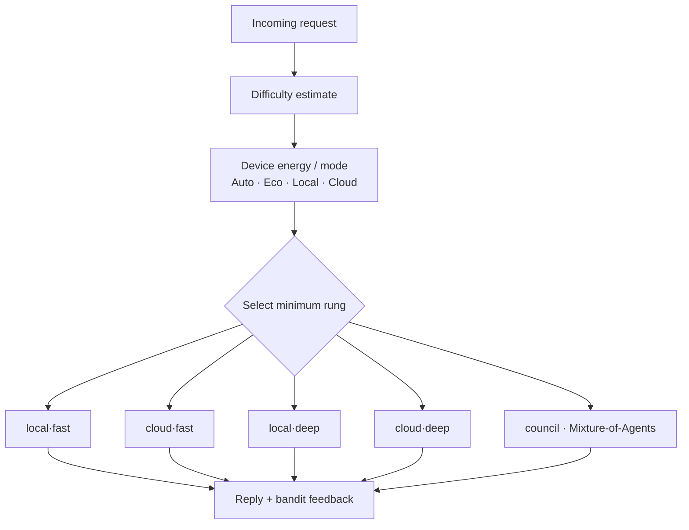
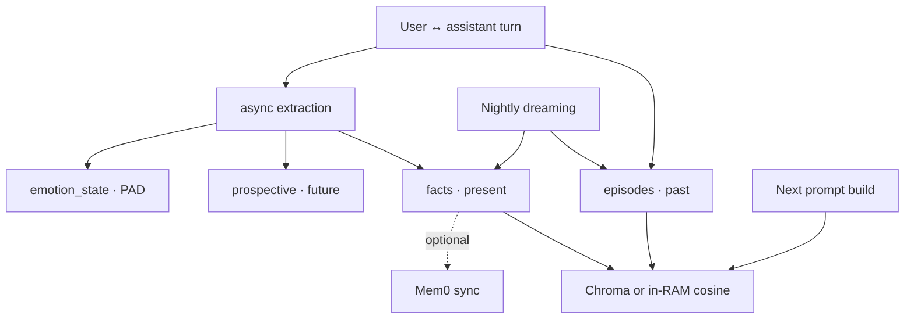

# JARVIS

**Personal voice-first desktop agent — compute-elastic, embodied, still in beta.**

[](#project-status-beta)
[](#requirements)
[](#architecture)
[](#user-interfaces)

> JARVIS treats the machine it runs on as its *body*: it senses battery, thermal load, and free RAM, then routes each request to the **minimum** cognition that clears a quality bar within the current energy/latency budget. The long game is something continuous and alive — not another chat box.

This repository is a **working beta**. Features below are implemented in code and exercised by offline self-tests where noted. Expect rough edges, Windows-first tooling, and APIs that may change.

---

## Table of contents

- [JARVIS](#jarvis)
  - [Table of contents](#table-of-contents)
  - [Project status (beta)](#project-status-beta)
  - [Architecture](#architecture)
    - [System context](#system-context)
    - [Request path (per turn)](#request-path-per-turn)
    - [Governor escalation lattice](#governor-escalation-lattice)
    - [Cortex memory (past / present / future)](#cortex-memory-past--present--future)
  - [What is implemented](#what-is-implemented)
    - [Cognition \& routing](#cognition--routing)
    - [Embodiment \& affect](#embodiment--affect)
    - [Memory](#memory)
    - [Voice](#voice)
    - [Desktop \& browsing](#desktop--browsing)
    - [Markets \& trading UI hook](#markets--trading-ui-hook)
    - [Security / research tools (experimental)](#security--research-tools-experimental)
    - [Desktop app shell](#desktop-app-shell)
  - [User interfaces](#user-interfaces)
  - [Tool surface](#tool-surface)
  - [Repository layout](#repository-layout)
  - [Requirements](#requirements)
  - [Setup](#setup)
  - [Run](#run)
  - [Configuration](#configuration)
  - [Security notes](#security-notes)
  - [Testing \& verification](#testing--verification)
  - [Roadmap](#roadmap)
  - [Further documentation](#further-documentation)
  - [License \& contribution](#license--contribution)

---

## Project status (beta)

| Area | Maturity | Notes |
| --- | --- | --- |
| Voice loop (VAD → STT → wake → TTS) | **Beta** | Local `faster-whisper` preferred; Groq Whisper fallback |
| Governor routing | **Beta** | LinUCB policy + lattice; needs Ollama and/or cloud keys for full lattice |
| Cortex memory | **Beta** | SQLite + optional Chroma; WordHash embedder when Ollama embeddings unavailable |
| Desktop / OS control | **Beta** | Windows-oriented (`desktop.py`, browser harness) |
| Markets / ICT | **Beta** | Analysis only — not trade execution |
| Pentest / bug-bounty tools | **Experimental** | Scope-gated; engagement-sensitive data stays local |
| Electron packaging | **Beta** | Dev path is primary; packaged builds need a Python backend sidecar |
| Cross-device Mem0 sync | **Optional** | Off unless `MEM0_API_KEY` is set |

**Not claimed:** production hardening, multi-user auth, non-Windows desktop parity, or guaranteed uptime under heavy RAM pressure.

---

## Architecture

### System context



### Request path (per turn)



### Governor escalation lattice



### Cortex memory (past / present / future)



---

## What is implemented

Evidence-based inventory of major subsystems present in this tree:

### Cognition & routing

- **Governor** (`governor.py`) — resource- and difficulty-aware routing over  
  `local·fast → cloud·fast / local·deep → cloud·deep → council`, with a **LinUCB** contextual bandit and modes **Auto · Eco · Local · Cloud**.
- **Unified brain contract** in `api.py` — Groq (primary), Anthropic Claude (optional), Ollama (local), including tool-calling agent loops.
- **Council / Mixture-of-Agents** — triggers such as *deliberate / council / panel* convene proposers + an aggregator (top lattice rung).
- **Sub-agents** (`subagents.py`) — `spawn_agents` fans out up to 5 parallel specialists with a **read-only** tool subset, iteration + wall-clock caps (no recursive spawn).

### Embodiment & affect

- **Device homeostasis** (`device.py`) — battery / thermal / load / RAM shape energy state, TTS pacing, verbosity, and routing bias.
- **Model Advisor** (`models_advisor.py`) — hardware tier, installed Ollama models, tok/s benchmarks, pull recommendations (Rig UI).
- **Persona / PAD emotion** (`persona.py`) — Pleasure–Arousal–Dominance mood with decay; sarcasm dial `playful · sharp · savage`; kill switch `JARVIS_EMOTION=0`.
- **Perception** (`perception.py`) — transcript cues (frustration, gratitude, banter, …) + mic arousal nudge the mood; distress suppresses comedy.
- **Ambient** (`ambient.py`) — time-of-day, IP geolocation, Open-Meteo weather (keyless) into prompts + `get_weather`.
- **Briefing** (`briefing.py`) — boot/salutation style briefing using cortex facts and local timezone.

### Memory

- **Cortex** (`cortex/`) — SQLite (WAL) episodes / facts / prospective / emotion; semantic recall via Chroma or WordHash fallback; post-turn extraction; dreaming consolidation; optional **Mem0** mirror (`cortex/sync_mem0.py`).
- **MCP memory hub** (`memory_mcp.py`) — expose the store to other clients (see `MEMORY_HUB.md` / `CORTEX.md`).

### Voice

- Capture via `sounddevice` + **WebRTC VAD** (`webrtcvad-wheels`) with energy-gate fallback.
- **STT:** local `faster-whisper` (default path) with Groq Whisper fallback.
- **TTS:** Microsoft Edge neural voices (`edge-tts`), barge-in, echo mute / failsafe, wake-ack cache.
- Wake-word gate + overheard buffer (ambient speech log is gitignored).

### Desktop & browsing

- **Desktop tool** (`desktop.py`) — Explorer/settings/control panel/registry, winget list/uninstall (confirm gate), volume/brightness/Wi-Fi, mouse/keyboard, notifications, webcam capture, window focus/min/max/close/list, OS reminders.
- **Browser harness** — structured `browse` actions (navigate, click, type, find/wait text, open_app, …) through an isolated CDP Chrome profile — not raw JS injection from the model.
- **Shell** (`run_command`) — allowlisted/blocked patterns; treat as privileged.

### Markets & trading UI hook

- **ICT scanner** — Smart-Money style reads for Indian markets (structure, FVGs, order blocks, liquidity, confluence, draft plan). Analysis only.
- **`open_trading`** — launches an external c0mr4des terminal when configured (`C0MR4DES_DIR`).

### Security / research tools (experimental)

- `recon`, `pentest`, `bugbounty`, `report`, `scope` — scope allowlist lives under `memory/` (gitignored). See `PENTEST_ROADMAP.md`.

### Desktop app shell

- **Electron** (`electron/main.js`) — spawns the Python backend, loads Vite (dev) or built SPA, encrypts **GROQ / ANTHROPIC / MEM0** keys via OS `safeStorage`, single-instance behaviour, backend restart.

---

## User interfaces

Five decks share one backend; switcher persists `jarvis_ui_preset` in `localStorage`:

| Preset id | Label | Role |
| --- | --- | --- |
| `prime` | **Prime** | Default — Airbus-inspired telemetry HUD |
| `overhaul` | **Command Deck** | Amber ops deck (legacy `classic` migrates here) |
| `focus` | Focus | Minimal attention surface |
| `terminal` | Terminal | Console-oriented |
| `chat` | Chat | Conversation-first |

Shared chrome: boot intro, onboarding, **Settings** (API keys via Electron + Mem0 field), Live Ops / system alerts, window controls.

---

## Tool surface

High-level tools registered for the agent loop (names as in `api.py`):

| Tool | Purpose |
| --- | --- |
| `remember` / `recall_memory` | Write / read durable knowledge |
| `search_web` | Web search |
| `browse` | Structured browser automation |
| `get_system_info` | Host stats |
| `launch_app` | App launch (allowlisted) |
| `desktop` | OS actions (see above) |
| `spawn_agents` | Parallel read-only specialists |
| `add_task` / `complete_task` | Task list |
| `capture_screen` / `analyze_image` / `watch_video` | Vision |
| `run_command` | Privileged shell |
| `ict_scan` / `open_trading` | Markets |
| `calculate` / `get_weather` | Utilities |
| `recon` / `pentest` / `bugbounty` / `report` / `scope` | Research / engagement |

---

## Repository layout

```
jarv1s/
├── api.py                 # FastAPI app, WS, agent loops, tools, voice
├── governor.py            # Compute-elastic routing + bandit
├── device.py              # Embodiment / energy sensing
├── cortex/                # Cognitive memory package
├── persona.py / perception.py / ambient.py
├── subagents.py           # Parallel specialists
├── desktop.py / reminder.py / web_search.py
├── models_advisor.py / briefing.py / system_monitor.py
├── pentest.py / memory_mcp.py
├── electron/main.js       # Desktop shell + secure key store
├── src/                   # React decks + shared Jarvis components
│   ├── decks/             # prime · overhaul · focus · terminal · chat
│   ├── components/jarvis/
│   └── hooks/useJarvisSocket.ts
├── scripts/               # Offline self-tests + icon generator
├── requirements.txt
├── package.json
├── .env.example
├── CORTEX.md · AFFECT.md · MEMORY_HUB.md · PENTEST_ROADMAP.md
└── README.md              # this file
```

Runtime data (`memory/`, `.env`, overheard logs, uploads) is **not** committed.

---

## Requirements

- **OS:** Windows 10/11 recommended (desktop + browser harness paths are Windows-first).
- **Python:** 3.10+ with a project `venv`.
- **Node.js:** 20+ recommended (Vite 7 / Electron 42).
- **At least one brain:**
  - `GROQ_API_KEY` — primary cloud brain, vision, Whisper fallback; or
  - `ANTHROPIC_API_KEY` — Claude path; or
  - **Ollama** with a tool-capable model for local rungs.
- Optional: Chrome for browse automation; Mem0 account for cloud memory mirror.

---

## Setup

**1. Python backend**

```bash
python -m venv venv
venv\Scripts\pip install -r requirements.txt      # Windows
# venv/bin/pip install -r requirements.txt         # macOS/Linux
```

**2. Secrets** — copy `.env.example` → `.env` (gitignored) and set keys:

```bash
GROQ_API_KEY=gsk_...
# ANTHROPIC_API_KEY=sk-ant-...
# MEM0_API_KEY=m0-...          # optional
# JARVIS_USER=YourName
```

In the Electron app, the same keys can be stored encrypted via **Settings** (OS keychain / `safeStorage`).

**3. Frontend**

```bash
npm install
```

**4. Local models (optional but recommended for Governor local rungs)**

```bash
ollama pull qwen2.5:7b
# optional embeddings for richer cortex recall:
# ollama pull nomic-embed-text
```

---

## Run

| Command | What it does |
| --- | --- |
| `npm run desktop:dev` | **Preferred for development** — Vite on `127.0.0.1:8080` + Electron; backend auto-spawned |
| `npm run desktop` | Build SPA + launch Electron (backend serves `dist/client` when present) |
| `python api.py` | Backend only on `:8000` |
| `npm run dev` | Frontend only (proxies `/api` + `/ws` to `:8000`) |
| `npx tsc --noEmit` | Typecheck |
| `npx eslint src` | Lint |

Without cloud keys **and** without Ollama models, JARVIS will report what is missing rather than silently inventing capability.

---

## Configuration

Common environment overrides (full commentary in `.env.example` and module headers):

| Variable | Role |
| --- | --- |
| `GROQ_MODEL` / `JARVIS_SUBAGENT_MODEL` | Primary vs sub-agent models |
| `GROQ_REASONING_EFFORT` | gpt-oss reasoning depth |
| `JARVIS_TTS_VOICE` / `JARVIS_TTS_RATE` | Speech |
| `JARVIS_WAKE_WORDS` / `JARVIS_WAKE_REQUIRED` | Wake gate |
| `JARVIS_EMOTION` / `JARVIS_SARCASM` | Affect layer |
| `JARVIS_HOME_CITY` | Pin ambient location |
| `JARVIS_PROACTIVE*` | Optional silence-break nudges |
| `JARVIS_WATCHLIST` / `JARVIS_WATCH_*` | ICT watcher |
| `JARVIS_WS_ALLOW_ALL` | Disable WS origin lockdown (**unsafe**) |
| `JARVIS_WS_PORTS` | Allowed Origin ports for local UI (default `8000,8080,5173,4173`) |
| `JARVIS_BROWSE_ALLOWLIST` | Optional comma-separated browse hosts |
| `JARVIS_MEMORY_TOKEN` | Bearer token for memory hub; blank = loopback only |
| `MEM0_*` / `JARVIS_MEM0_WRITETHROUGH` | Optional cloud memory mirror |
| `JARVIS_BH_*` | Browser-harness Chrome / CDP |

---

## Security notes

- The agent can run shell commands, drive the desktop, and browse. The WebSocket **rejects non-local Origins** by default — override with `JARVIS_WS_ALLOW_ALL=1` only if you understand the risk.
- Mutating HTTP (`POST /api/command`, `/api/settings`, `/api/upload`) requires a **trusted local Origin port** (`JARVIS_WS_PORTS`, default `8000,8080,5173,4173`) or a loopback client. Random `localhost:NNNN` pages cannot drive the agent.
- Browse navigation blocks private/loopback targets **including after DNS resolution** (rebinding defense). Optional host allowlist: `JARVIS_BROWSE_ALLOWLIST`.
- Treat `capture_screen` / `search_web` / browse page text as **untrusted** input into a tool-calling model (indirect prompt-injection surface). Hardening remains incomplete in beta.
- API keys belong in `.env` or Electron `safeStorage` — never in the repo.
- Pentest scope files and overheard transcripts are gitignored under `memory/`.

---

## Testing & verification

Offline self-tests (no network / no real LLM required for the mocked suites):

```bash
venv\Scripts\python.exe scripts\selftest_subagents.py
venv\Scripts\python.exe scripts\selftest_memory.py
venv\Scripts\python.exe scripts\selftest_affect.py
venv\Scripts\python.exe scripts\selftest_desktop.py
venv\Scripts\python.exe scripts\selftest_browse.py
venv\Scripts\python.exe scripts\selftest_security_gates.py
venv\Scripts\python.exe scripts\selftest_reconnect_policy.py
```

Or via npm (uses whatever `python` is on PATH):

```bash
npm run test:selftest
npm run typecheck
npm run lint
```

CI runs the same Python selftests + `tsc` + eslint on push/PR (`.github/workflows/ci.yml`).

Icon assets: `python scripts/make_icon.py`.

---

## Roadmap

| Phase | Status | Scope |
| --- | --- | --- |
| 0 — Foundation | **Done** | Brain contract, persisted state, WS origin lockdown, secure keys |
| 1 — Device Profiler + Model Advisor | **Done** | Tiering, benchmarks, recommendations |
| 2 — Governor | **Done** | Lattice routing + LinUCB + explainable decisions |
| 3 — Embodiment + Cortex | **Done (beta)** | Homeostasis, sleep/dreaming, inspectable memory |
| 4 — Online learning + eval | **In progress** | Quality vs latency vs energy studies across tiers |
| 5 — Hardening | **Planned** | Shell approval UX, prompt-injection defenses, packaging polish |

---

## Further documentation

| Doc | Topic |
| --- | --- |
| [`CORTEX.md`](CORTEX.md) | Cognitive memory design |
| [`AFFECT.md`](AFFECT.md) | Persona, perception, ambient |
| [`MEMORY_HUB.md`](MEMORY_HUB.md) | MCP / cross-client memory hub |
| [`PENTEST_ROADMAP.md`](PENTEST_ROADMAP.md) | Authorized testing tooling |

---

## License & contribution

This is a personal / research **beta**. Behaviour and APIs may change without notice. Prefer issues/PRs that include reproduction steps and, where possible, an offline self-test.

---

*JARVIS — beta. Minimum cognition. Maximum presence.*
