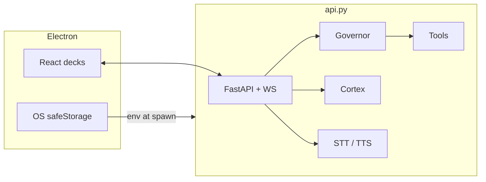

# JARVIS

**Personal voice-first desktop agent — compute-elastic, embodied, still in beta.**

[](#status)
[](#requirements)
[](#architecture)

JARVIS treats the machine it runs on as its *body*: it senses battery, thermal load, and free RAM, then routes each request to the **minimum** cognition that clears a quality bar within the current energy/latency budget.

This repository is a **working beta**. Expect rough edges, Windows-first tooling, and APIs that may change.

---

## Status

| Area | Maturity | Notes |
| --- | --- | --- |
| Voice (VAD → STT → wake → TTS) | Beta | Local `faster-whisper`; Groq Whisper fallback |
| Governor routing | Beta | LinUCB + lattice; Ollama and/or cloud keys for full path |
| Cortex memory | Beta | SQLite + optional Chroma; WordHash when embeddings unavailable |
| Desktop / OS control | Beta | Windows-oriented |
| Markets / ICT | Beta | Analysis only — not trade execution |
| Pentest / research tools | Experimental | Scope-gated; needs Docker + `jarvis-recon` image |
| Electron packaging | Beta | Dev path primary; packaged builds need a Python sidecar |

**Not claimed:** production hardening, multi-user auth, non-Windows desktop parity.

---

## Architecture



**Per turn:** utterance → WebSocket → cortex prompt build → governor picks rung (`local·fast` → `cloud·fast` / `local·deep` → `cloud·deep` → council) → brain + tools → reply + TTS → async memory extract.

---

## What it does

- **Governor** — resource-aware routing over local/cloud rungs + optional Mixture-of-Agents council
- **Cortex** — past/present/future memory (episodes, facts, prospective) with semantic recall
- **Affect** — PAD mood (`persona.py`) + transcript perception + ambient time/place/weather
- **Voice** — WebRTC VAD, faster-whisper / Groq STT, Edge TTS, wake word
- **Desktop** — Explorer, winget, volume, windows, notifications, structured browser harness
- **Sub-agents** — up to 5 parallel read-only specialists
- **Markets** — ICT-style reads for Indian markets (analysis only)
- **Pentest** — passive `recon` anywhere; active scans only for scoped targets

### Cortex (memory)

SQLite at `memory/cortex.sqlite` (WAL). Optional Chroma index. Every brain call flows through `cortex.build_system_prompt`. After each turn, extraction writes facts / prospective / emotion nudges (fail-soft). Nightly consolidation: `python -m cortex.dreaming`.

Optional Mem0 cloud mirror when `MEM0_API_KEY` is set (`python -m cortex.sync_mem0`). Private facts never leave the machine.

### Affect

- `persona.py` — Pleasure–Arousal–Dominance mood with decay; `JARVIS_SARCASM=playful|sharp|savage`
- `perception.py` — frustration / gratitude / banter cues; distress suppresses sarcasm
- `ambient.py` — local time, IP geo (or `JARVIS_HOME_CITY`), Open-Meteo weather  
  Kill switch: `JARVIS_EMOTION=0`

### Memory hub

`memory_mcp.py` exposes cortex over MCP so other clients can share the same store. Cortex stays authoritative — MCP is an adapter, not a second brain.

### Pentest (experimental)

| Rule | Behaviour |
| --- | --- |
| Recon | Passive only — any target |
| Attack | Refused unless target is in `memory/jarvis_scope.json` |

Requires **Docker Desktop running** and image `jarvis-recon:latest`:

```bash
docker build -t jarvis-recon:latest -f docker/jarvis-recon/Dockerfile docker/jarvis-recon
```

Image includes dig, curl, subfinder, httpx, nmap, ffuf, nuclei, sqlmap. Override with `JARVIS_KALI_IMAGE=...`.

---

## Decks

| Preset | Role |
| --- | --- |
| `prime` | Default Airbus-inspired HUD |
| `overhaul` | Command Deck (amber ops) |
| `focus` | Minimal |
| `terminal` | Console |
| `chat` | Conversation-first |

---

## Layout

```
jarv1s/
├── api.py              # FastAPI, WS, agent loops, tools, voice
├── governor.py         # Compute-elastic routing
├── cortex/             # Cognitive memory
├── persona.py · perception.py · ambient.py
├── desktop.py · pentest.py · subagents.py
├── electron/           # Desktop shell + encrypted keys
├── src/decks/          # React UIs
├── docker/jarvis-recon/
├── requirements.txt · package.json · .env.example
└── README.md
```

Runtime data (`memory/`, `.env`, overheard logs) is **not** committed.

---

## Requirements

- Windows 10/11 (desktop paths are Windows-first)
- Python 3.10+ · Node 20+
- At least one brain: `GROQ_API_KEY`, `ANTHROPIC_API_KEY`, or Ollama with a tool-capable model
- Optional: Docker Desktop (pentest), Chrome (browse), Mem0

---

## Setup

```bash
python -m venv venv
venv\Scripts\pip install -r requirements.txt
copy .env.example .env          # set GROQ_API_KEY=...
npm install
# optional: ollama pull qwen2.5:7b
# optional: ollama pull nomic-embed-text
```

Keys can also be stored encrypted via **Settings** in the Electron app.

---

## Run

| Command | What |
| --- | --- |
| `npm run desktop:dev` | **Preferred** — Vite + Electron; backend auto-spawned |
| `npm run desktop` | Build SPA + Electron |
| `python api.py` | Backend only (`:8000`) |
| `npm run dev` | Frontend only (proxies to `:8000`) |
| `npm run typecheck` / `npm run lint` / `npm run test:e2e` | Checks |

---

## Configuration

| Variable | Role |
| --- | --- |
| `GROQ_MODEL` / `JARVIS_SUBAGENT_MODEL` | Primary vs sub-agent models |
| `JARVIS_TTS_VOICE` / `JARVIS_WAKE_WORDS` | Speech / wake |
| `JARVIS_EMOTION` / `JARVIS_SARCASM` | Affect |
| `JARVIS_HOME_CITY` | Pin ambient location |
| `JARVIS_SHELL_APPROVAL` | Confirm before shell tools (`1` recommended) |
| `JARVIS_WS_PORTS` / `JARVIS_WS_ALLOW_ALL` | WS origin lockdown |
| `JARVIS_BROWSE_ALLOWLIST` | Optional browse hosts |
| `JARVIS_MEMORY_TOKEN` | Bearer for memory hub (blank = loopback only) |
| `JARVIS_KALI_IMAGE` | Override pentest container image |
| `MEM0_*` | Optional cloud memory mirror |

See `.env.example` for the full list.

---

## Security

- Shell, desktop, and browse are privileged. WebSocket rejects non-local Origins by default.
- Mutating HTTP requires a trusted local Origin port (`JARVIS_WS_PORTS`) or loopback.
- Browse blocks private/loopback targets after DNS (rebinding defense).
- Treat page text / search results as untrusted model input (prompt-injection surface still hardening).
- API keys in `.env` or Electron `safeStorage` only — never in git.
- Pentest scope files and overheard transcripts stay under gitignored `memory/`.

---

## License

Personal / research **beta**. APIs may change. Prefer issues/PRs with reproduction steps.

*JARVIS — beta. Minimum cognition. Maximum presence.*
