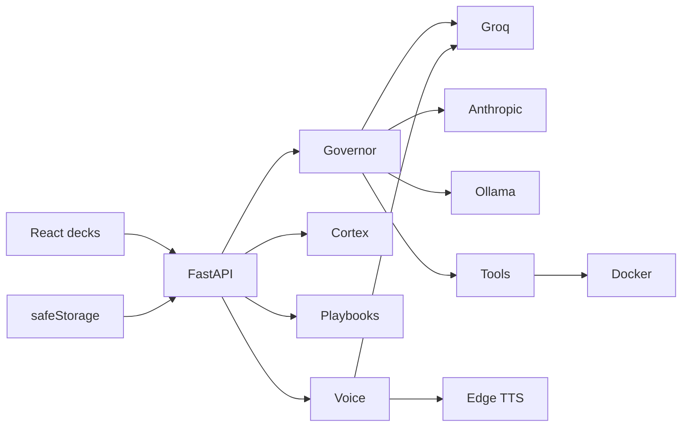
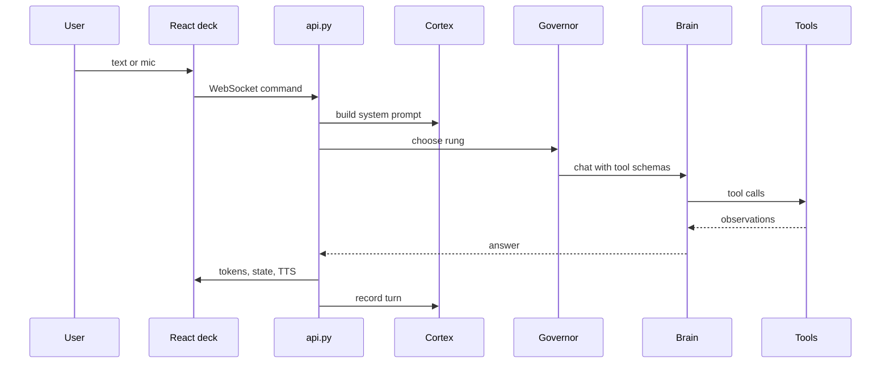

# JARVIS

**Personal voice-first desktop agent** — local by default, cloud when it helps, still in **beta**.

[](#project-status)
[](#requirements)
[](#architecture)
[](#user-interfaces)

---

## What this project is

JARVIS is a **desktop companion agent** that runs on your machine: you speak or type, it thinks with a local or cloud model, can use tools (files, browser, shell, memory), and talks back. It is closer to an always-available operator for *your* PC than to a website chatbot.

The design bet is **embodiment**. The process reads host signals (battery, load, free RAM) and a **governor** chooses the cheapest cognition that still clears a quality bar — local fast models when the machine is strained, stronger cloud models when the task needs them, and an optional multi-model “council” for hard questions. Memory is persistent on disk (Cortex): facts, recent episodes, and future reminders feed the next turn. Mood and tone shift with context (affect layer), and optional **skills** are on-disk playbooks the agent can load when a task matches.

You interact through an Electron app with several UI decks (Prime, Stark, Command Deck, Focus, Terminal, Chat). Under the hood a Python FastAPI backend owns WebSocket chat, tools, voice, and memory; the React UI is a client. Minimizing the window leaves a small desktop pill (`public/pill.html`), not a second full app.

**Beta means:** documented capabilities exist in this repository and are usable, but APIs, UX, and packaging can change. The stack is **Windows-first** for desktop and browser automation. It is not production-hardened, not multi-user, and not claimed to offer equal desktop control on macOS/Linux.

---

## Table of contents

- [JARVIS](#jarvis)
  - [What this project is](#what-this-project-is)
  - [Table of contents](#table-of-contents)
  - [Project status](#project-status)
  - [Features](#features)
  - [Architecture](#architecture)
    - [How a session feels](#how-a-session-feels)
  - [Requirements](#requirements)
  - [Fresh install (exact steps)](#fresh-install-exact-steps)
    - [1. Clone](#1-clone)
    - [2. Python virtualenv (required by Electron)](#2-python-virtualenv-required-by-electron)
    - [3. Environment file](#3-environment-file)
    - [4. Node dependencies](#4-node-dependencies)
    - [5. Free the backend port (or set one)](#5-free-the-backend-port-or-set-one)
    - [6. Start the desktop app (preferred)](#6-start-the-desktop-app-preferred)
    - [7. First-run in the UI](#7-first-run-in-the-ui)
    - [Optional after first boot](#optional-after-first-boot)
  - [Running](#running)
  - [Troubleshooting](#troubleshooting)
  - [Configuration](#configuration)
  - [User interfaces](#user-interfaces)
  - [Tools](#tools)
  - [Skills](#skills)
  - [OpenClaw](#openclaw)
  - [Optional: Docker pentest image](#optional-docker-pentest-image)
  - [Repository layout](#repository-layout)
  - [Development checks](#development-checks)
  - [Security notes](#security-notes)
  - [License](#license)

---

## Project status

| Area | Maturity | What’s in the tree |
| --- | --- | --- |
| Voice (VAD → STT → wake → TTS) | **Beta** | `webrtcvad-wheels` / energy gate; local `faster-whisper`; Groq Whisper fallback; Edge TTS |
| Governor routing | **Beta** | Lattice + LinUCB (`jarvis/cognition/governor.py`) |
| Cortex memory | **Beta** | SQLite WAL + optional Chroma; WordHash embeddings if Ollama embed model missing |
| Desktop / OS control | **Beta** | Windows-oriented (`desktop.py`) |
| Browser automation | **Beta** | Structured `browse` tool; needs Chrome (+ optional browser-harness paths) |
| Markets / ICT | **Beta** | Analysis via `ict_scan` — **not** trade execution |
| Skills | **Beta** | `jarvis/playbooks/loader.py` + `skills/*/SKILL.md` |
| Pentest / research | **Experimental** | Scope-gated active tools; Docker + `jarvis-recon:latest` |
| Electron shell | **Beta** | Dev path (`npm run desktop:dev`) is primary; packaged sidecar is separate |

**Out of scope for this beta:** production SLAs, multi-user auth, and full desktop parity on non-Windows hosts.

---

## Features

What you can actually do with the code in this tree:

- **Talk or type** — wake-word gated listening (default includes `jarvis`), always-listen option, Edge TTS replies with barge-in mute
- **Stay on-machine when possible** — governor routes across local/cloud rungs and optional Mixture-of-Agents council
- **Remember** — Cortex stores episodes, durable facts, and prospective items; every reply path builds a system prompt from that store
- **Act on the PC** — desktop actions, allowlisted app launch, approval-gated shell (`run_command`)
- **Browse and research** — structured browser tool, web search, optional skill playbooks for repeatable procedures
- **Specialize** — `spawn_agents` runs capped parallel read-only specialists; markets tools do ICT-style analysis only
- **Security research (experimental)** — passive `recon` anywhere; active scans only for targets in the local scope allowlist

Subsystem map (same capabilities, named by module):

- **Governor** — rung selection from difficulty + device energy (`jarvis/cognition/governor.py`, `jarvis/host/device.py`)
- **Cortex** — prompt build, async extraction, optional `python -m cortex.dreaming`
- **Affect** — PAD mood (`jarvis/presence/persona.py`), transcript cues (`jarvis/presence/perception.py`), ambient time/place/weather (`jarvis/presence/ambient.py`)
- **Skills** — on-disk playbooks; catalog in the system prompt; full body via `use_skill`

---

## Architecture


```mermaid
graph LR
  UI[React decks] --> WS[FastAPI]
  Keys[safeStorage] --> WS
  WS --> Gov[Governor]
  WS --> Cortex[Cortex]
  WS --> Skills[Playbooks]
  WS --> Voice[Voice]
  Gov --> Groq[Groq]
  Gov --> Claude[Anthropic]
  Gov --> Ollama[Ollama]
  Gov --> Tools[Tools]
  Voice --> Groq
  Voice --> Edge[Edge TTS]
  Tools --> Docker[Docker]
```


```mermaid
sequenceDiagram
  participant U as User
  participant FE as React deck
  participant API as api.py
  participant C as Cortex
  participant G as Governor
  participant B as Brain
  participant T as Tools

  U->>FE: text or mic
  FE->>API: WebSocket command
  API->>C: build system prompt
  API->>G: choose rung
  G->>B: chat with tool schemas
  B->>T: tool calls
  T-->>B: observations
  B-->>API: answer
  API->>FE: tokens, state, TTS
  API->>C: record turn
```

**Port contract:** in `desktop:dev`, Vite proxies `/api` and `/ws` to `http://127.0.0.1:${JARVIS_PORT||8000}`. The backend must listen on that same port. Desktop mode does **not** silently bind a different free port when the preferred port is taken — otherwise the UI and API would disagree about where the backend lives.

### How a session feels

1. Electron starts (or you run `api.py` alone) and the UI connects over WebSocket.
2. You type a command or say the wake word, then speak.
3. Cortex builds a system prompt (persona, ambient context, recalled facts/episodes, skills catalog).
4. The governor picks a model rung; the brain may call tools (desktop, browse, memory, skills, …).
5. The reply streams back to the deck and optionally speaks via Edge TTS; the turn is recorded for later recall.

That loop is the product. The install commands below only get you into it.

---

## Requirements

| Need | Detail |
| --- | --- |
| OS | **Windows 10/11** recommended (desktop + Electron `desktop:dev` script uses `set …`) |
| Python | **3.10+** with a project **`./venv`** |
| Node.js | **20+** (Vite 7 / Electron in `package.json`) |
| Brain (at least one) | `GROQ_API_KEY` and/or `ANTHROPIC_API_KEY` and/or **Ollama** with a tool-capable model |
| Disk / RAM | Core venv is ~400 MB lighter without the extras; for everyday use launch with `launch-jarvis.cmd` / `npm run desktop` (no Vite dev server, ~700 MB less RAM than `desktop:dev`). Local Ollama models are only offered when free RAM allows |

**Optional**

| Feature | Extra requirement |
| --- | --- |
| Richer semantic memory | Ollama + `nomic-embed-text` (else WordHash fallback) |
| Local rungs | Ollama + a chat model (e.g. `qwen2.5:7b`) |
| `browse` | Google Chrome; optional `JARVIS_BH_*` / `JARVIS_CHROME` |
| Pentest tools | Docker Desktop **running** + built `jarvis-recon:latest` |
| Mem0 mirror | `MEM0_API_KEY` + `mem0ai` (`requirements-extras.txt`) |
| ICT market scanner | `yfinance` + `pandas` (`requirements-extras.txt`) |
| Video understanding / webcam snapshot | `opencv-python-headless` + `yt-dlp` (`requirements-extras.txt`) |
| Persistent Chroma vector index | `chromadb` (`requirements-extras.txt`); without it cortex uses a compact in-RAM index rebuilt from SQLite on boot |

---

## Fresh install (exact steps)

This section is the mechanical install path. If you have not read [What this project is](#what-this-project-is), start there — JARVIS is an Electron + Python agent, not a single CLI binary.

Complete every step before launching. A missing `./venv` or a busy port `8000` will prevent a normal boot.

### 1. Clone

```bat
git clone https://github.com/roshansrikanth21/jarv1s.git
cd jarv1s
```

### 2. Python virtualenv (required by Electron)

Electron will **not** fall back to a bare global `python` / `py`. It looks for `.\venv\Scripts\python.exe`, or `JARVIS_PYTHON`.

```bat
python -m venv venv
venv\Scripts\pip install --upgrade pip
venv\Scripts\pip install -r requirements.txt
```

That is the lean core. The heavy optional features (market scanner, video understanding, Chroma vectors, Mem0 mirror) are in a separate file — install it only if you want them; each feature tells you what to install if you use it without:

```bat
venv\Scripts\pip install -r requirements-extras.txt
```

### 3. Environment file

```bat
copy .env.example .env
```

Edit `.env` and set at least:

```env
GROQ_API_KEY=gsk_...
```

(Or use Anthropic / Ollama instead — see [Configuration](#configuration).)

### 4. Node dependencies

```bat
npm install
```

### 5. Free the backend port (or set one)

Default backend + Vite proxy port is **8000**.

- If Docker Desktop, WSL, or another app owns 8000, either free it, **or** set the **same** value everywhere:

```bat
set JARVIS_PORT=8010
```

Then start Vite/Electron with that variable still set in the same terminal (see below).

### 6. Start the desktop app (preferred)

```bat
npm run desktop:dev
```

What this does (`package.json`):

1. Sets `JARVIS_USE_VITE=1`
2. Starts Vite on `127.0.0.1:8080`
3. Starts Electron, which spawns `venv\Scripts\python.exe api.py` with `JARVIS_DESKTOP=1` and `JARVIS_PORT` (default 8000)
4. Loads the UI from `http://127.0.0.1:8080` (proxied `/api` + `/ws` → backend)

### 7. First-run in the UI

1. Open **Settings** (gear) if you prefer OS-encrypted keys instead of `.env`
2. Confirm the status / mic indicators respond (backend returns `"app": "jarvis"` on `/api/agent/status`)
3. Send a short text command (e.g. ask the time) before relying on voice

### Optional after first boot

```bat
ollama pull qwen2.5:7b
ollama pull nomic-embed-text
```

```bat
docker build -t jarvis-recon:latest -f docker/jarvis-recon/Dockerfile docker/jarvis-recon
```

---

## Running

| Command | What it does |
| --- | --- |
| `npm run desktop:dev` | **Preferred for development** — Vite `:8080` + Electron; backend auto-spawned from `./venv` |
| `npm run electron:dev` | Alias of `desktop:dev` |
| `npm run desktop` | `vite build` then Electron (UI served from backend when `dist` is present) |
| `npm run desktop:fast` | Electron only (expects a backend already available / previous build) |
| `launch-jarvis.cmd` | **Lightest everyday launch** — builds `dist` once, then Electron only (no Vite dev server, ~700 MB less RAM than `desktop:dev`) |
| `venv\Scripts\python.exe api.py` | Backend only (default `http://127.0.0.1:8000`) |
| `npm run dev` | Frontend only; proxies `/api` + `/ws` to `JARVIS_PORT` (default 8000) — start `api.py` yourself |
| `npm run typecheck` | `tsc --noEmit` |
| `npm run lint` | ESLint |
| `npm run test:e2e` | Playwright smoke (`e2e/smoke.spec.ts`) |
| `npm run test:kernel` | Python unit tests for the `jarvis/` kernel |
| `npm run audit:local` | Offline/runtime audit (copies harness into gitignored `.local/` first) |

Without any cloud key **and** without Ollama models, the process can still boot, but chat will report what’s missing rather than invent capability.

---

## Troubleshooting

| Symptom | Likely cause | Fix |
| --- | --- | --- |
| Electron shows “backend failed to boot” / no `./venv` | Fresh clone without venv | Run the [venv steps](#2-python-virtualenv-required-by-electron) |
| UI loads but API/WS never connect | Port split (8000 busy / remapped) or wrong `JARVIS_PORT` | Free 8000, **or** set the same `JARVIS_PORT` for backend and Vite; desktop mode refuses silent remapping |
| `/api/agent/status` is 404 on 8000 | Another process (e.g. WSL/Docker relay) owns the port | Stop that process or set `JARVIS_PORT`; Electron only reuses a backend that returns `"app": "jarvis"` |
| Import errors / missing `yaml` | Incomplete pip install | `venv\Scripts\pip install -r requirements.txt` (`PyYAML` is listed explicitly) |
| Voice / STT silent | No mic permission; a loopback or silent device; missing `faster-whisper` and no Groq | Install requirements; pick a real microphone; set `GROQ_API_KEY` for cloud STT fallback. A clip the VAD empties is decoded once more without VAD before it is dropped. |
| Cloud replies say the model does not exist | Groq retired the configured id | Leave `GROQ_MODEL` unset, or set it to an id from `GET https://api.groq.com/openai/v1/models`. JARVIS retries once against the live list. |
| `browse` fails | Chrome / harness path | Install Chrome; set `JARVIS_CHROME` / `JARVIS_BH_CLI` if needed (see `.env.example`) |
| Pentest says Docker unavailable | Engine down or image missing | Start Docker Desktop; build `jarvis-recon:latest` |
| Second Electron window does nothing | Single-instance lock | Focus the existing window |

---

## Configuration

Copy `.env.example` → `.env`. Common keys (full comments live in `.env.example`):

| Variable | Role |
| --- | --- |
| `GROQ_API_KEY` | Primary cloud brain / Whisper / vision (OpenAI-compatible Groq API) |
| `ANTHROPIC_API_KEY` | Optional Claude path |
| `GROQ_MODEL` | Preferred chat model. Default `qwen/qwen3.8-27b`. If Groq returns 404, JARVIS picks another chat model from that key's live `/models` list (skips Whisper and TTS). |
| `JARVIS_SUBAGENT_MODEL` | Smaller/faster model for `spawn_agents` |
| `JARVIS_TTS_VOICE` / voice via Settings | Edge neural voices |
| `JARVIS_WAKE_WORDS` / `JARVIS_WAKE_REQUIRED` | Wake gate |
| `JARVIS_ALWAYS_LISTEN` | Start mic when a client connects |
| `JARVIS_EMOTION` / `JARVIS_SARCASM` | Affect layer (`0` disables emotion) |
| `JARVIS_HOME_CITY` | Pin ambient location |
| `JARVIS_SHELL_APPROVAL` / `JARVIS_APPROVAL_TOOLS` | UI confirm before privileged tools (default includes `run_command`) |
| `JARVIS_WS_PORTS` / `JARVIS_WS_ALLOW_ALL` | WebSocket Origin policy |
| `JARVIS_BROWSE_ALLOWLIST` | Optional host allowlist for browse |
| `JARVIS_MEMORY_TOKEN` | Bearer for memory hub HTTP; blank = loopback-oriented use |
| `JARVIS_AGENT_TOKEN` | Bearer required by `POST /api/ask` (OpenClaw bridge); blank = loopback / trusted origin only |
| `JARVIS_MCP_TOKEN` / `JARVIS_MCP_HOST` | Bearer + bind address for `python -m jarvis.agent_mcp --http` |
| `JARVIS_ASK_TIMEOUT` | Seconds the OpenClaw bridge waits for a reply (default 120) |
| `JARVIS_PYTHON` | Explicit Python for Electron if `./venv` is absent |
| `JARVIS_PORT` | Backend bind + Vite proxy target (must match in `desktop:dev`) |
| `JARVIS_ALLOW_PORT_FALLBACK` | Allow bind on a free port when preferred is busy (**off** for typical desktop/Vite) |
| `JARVIS_SKILLS_DIR` | Override skills root (absolute path preferred) |
| `JARVIS_KALI_IMAGE` | Override pentest container image |
| `JARVIS_CHROME` / `JARVIS_BH_*` | Browser automation paths |
| `MEM0_API_KEY` / `MEM0_USER_ID` / `JARVIS_MEM0_WRITETHROUGH` | Optional cloud memory mirror |

In the Electron app, **Settings** can store `GROQ` / `ANTHROPIC` / `MEM0` keys via OS `safeStorage` and inject them when spawning the backend.

---

## User interfaces

Six decks share one backend. The switcher persists `jarvis_ui_preset` in `localStorage` (`src/routes/index.tsx`). Legacy `classic` maps to Command Deck.

| Preset id | Label | Role |
| --- | --- | --- |
| `prime` | Prime | Default HUD |
| `stark` | Stark | Machine readout, weather, and quick asks |
| `overhaul` | Command Deck | Amber ops deck |
| `focus` | Focus | Minimal |
| `terminal` | Terminal | Console-oriented |
| `chat` | Chat | Conversation-first |

Shared chrome is Settings, Activity, and window controls. Minimizing the Electron window shows the desktop pill. Deck names are not repeated in each top bar; the switcher at the bottom already names the deck.

---

## Tools

Registered agent tools (names as in `api.py` `TOOLS`):

| Tool | Purpose |
| --- | --- |
| `remember` / `recall_memory` | Write / read durable knowledge |
| `search_web` | Web search |
| `browse` | Structured browser automation |
| `get_system_info` | Host stats |
| `launch_app` | App launch (allowlisted) |
| `desktop` | OS actions |
| `spawn_agents` | Parallel read-only specialists |
| `add_task` / `complete_task` | Task list |
| `capture_screen` / `analyze_image` / `watch_video` | Vision |
| `run_command` | Privileged shell (approval-gated by default) |
| `ict_scan` / `open_trading` | Markets / external terminal hook |
| `calculate` / `get_weather` | Utilities |
| `use_skill` / `create_skill` | Load / author on-disk skill playbooks |
| `recon` / `pentest` / `bugbounty` / `report` / `scope` | Research / engagement |

HTTP helpers include `/api/agent/status` (includes `"app": "jarvis"`), `/api/settings`, `/api/skills`, `/api/ask` (run a turn and return the reply — see [OpenClaw](#openclaw)), and memory hub routes under `/api/memory/*` (see `routers/rest.py`).

---

## Skills

Skills are **procedural playbooks** stored on disk so the agent can reuse a known procedure instead of improvising every time. Each skill is a folder under `skills/<slug>/` containing a `SKILL.md` file: YAML frontmatter (`name`, `description`) plus a markdown body of steps. Discovery is handled by `jarvis/playbooks/loader.py`; the default root is `<repo>/skills`.

At prompt time the model only sees a short `[SKILLS]` catalog (names + descriptions). When a task fits, it calls `use_skill` to load the full instructions. `create_skill` can write new playbooks; bundled seed slugs are protected from overwrite unless forced in code.

Bundled seeds in this repository:

- `deep-web-research`
- `market-brief`
- `system-triage`

Override the skills directory with an absolute `JARVIS_SKILLS_DIR` if needed.

---

## OpenClaw

[OpenClaw](https://docs.openclaw.ai) can hand requests to JARVIS — so "open notepad on my laptop" sent from WhatsApp or Telegram runs on this PC. The bridge is an MCP server, `jarvis/agent_mcp.py`, that forwards to the running backend:

| MCP tool | What it does |
| --- | --- |
| `jarvis_ask` | Runs a full JARVIS turn (tools, desktop, memory) and returns the reply. `speak=false` answers silently |
| `jarvis_status` | Is JARVIS up, which brain, memory count |
| `jarvis_recall` | Semantic search over JARVIS's memory (private memories excluded) |
| `jarvis_remember` | Store a durable fact, tagged `source_model=openclaw` |

**Same machine (stdio).** With OpenClaw installed and `./venv` set up:

```bat
venv\Scripts\python scripts\openclaw_setup.py
```

This runs `openclaw mcp add jarvis …` with this machine's paths (OpenClaw probes the server before saving), installs the skill in `integrations/openclaw/jarvis/` so OpenClaw's agent knows when to use JARVIS, and reloads MCP. Add `--dry-run` to only print the commands. Check with `openclaw mcp probe jarvis`; undo with `openclaw mcp unset jarvis`. JARVIS must be running for the tools to answer — otherwise they say so.

**Another machine or WSL (streamable HTTP).** Set `JARVIS_MCP_TOKEN` in `.env`, then:

```bat
venv\Scripts\python -m jarvis.agent_mcp --http 8766 --host 0.0.0.0
```

and on the OpenClaw side: `openclaw mcp add jarvis --url http://<pc-ip>:8766/mcp --transport streamable-http --header "Authorization=Bearer <token>" --timeout 180`. The server refuses to start without the token. The JARVIS backend itself stays on loopback; only the bridge port is exposed.

Under the hood the bridge calls `POST /api/ask` (`{"message", "speak", "timeout_s"}` → `{"status", "reply", "tools", "elapsed_s"}`). Unlike `/api/command` it waits for the turn and returns what JARVIS said. Remote turns go through the same dispatch as voice and typed input, so they show up in the HUD, can be barged in on (`status: "interrupted"`), and privileged tools still wait for approval in the UI. `/api/ask` accepts loopback/trusted-origin callers, or only a matching bearer once `JARVIS_AGENT_TOKEN` is set.

---

## Optional: Docker pentest image

Active scanning tools run in throwaway containers. Build:

```bat
docker build -t jarvis-recon:latest -f docker/jarvis-recon/Dockerfile docker/jarvis-recon
```

Requires Docker Desktop **engine running** (CLI alone is not enough). Override image name with `JARVIS_KALI_IMAGE`.

Scope allowlist for active attacks: `memory/jarvis_scope.json` (gitignored).

> Note: `docker/jarvis-recon.Dockerfile` (alternate) expects a `kali-mcp` base image — use the `docker/jarvis-recon/Dockerfile` path above for a self-contained build.

---

## Repository layout

```
jarv1s/
├── api.py                 # Process entry. FastAPI, WebSocket, turn loop, voice
├── jarvis/host/           # device, model advisor, hardware watchdog
├── jarvis/cognition/      # governor + route plans
├── jarvis/presence/       # ambient, briefing, perception, persona
├── jarvis/act/            # desktop, web search, reminders, scoped research
├── jarvis/agents/         # parallel specialists
├── jarvis/playbooks/      # skill loader; playbooks stay in skills/
├── jarvis/memory_mcp.py   # separate process: python -m jarvis.memory_mcp
├── jarvis/agent_mcp.py    # separate process: OpenClaw bridge (python -m jarvis.agent_mcp)
├── jarvis/                # also memory, policy, events, session, telemetry
├── integrations/openclaw/ # OpenClaw skill telling its agent when to use JARVIS
├── skills/                # Seed SKILL.md playbooks
├── cortex/                # SQLite memory, vectors, dreaming
├── routers/rest.py        # HTTP routes
├── scripts/audit_az.py    # Local audit. Reads GROQ_API_KEY from the environment
├── scripts/openclaw_setup.py  # Registers JARVIS with a local OpenClaw install
├── tests/
├── electron/main.js       # Window, backend spawn, minimize → desktop pill
├── public/pill.html       # Small always-on-top island used while minimized
├── docs/JARVIS_Architecture_Final.pptx
├── src/decks/             # prime, stark, overhaul, focus, terminal, chat
├── requirements.txt          # lean core
├── requirements-extras.txt   # optional heavy features
├── package.json
├── .env.example
└── README.md
```

Runtime data (not committed): `memory/`, `.env`, overheard logs, `uploads/`, `venv/`, `node_modules/`, `.local/` (machine-local audits & scratch).

---

## Development checks

```bat
npm run typecheck
npm run lint
npm run test:e2e
npm run test:kernel
npm run audit:local
```

Copy or keep a machine-local audit harness under `.local/` (gitignored). Unit tests under `tests/` are what CI/devs should rely on.
CI (`.github/workflows/ci.yml`) runs typecheck, lint, and Playwright on push/PR (npm 10 + Node 22 on `windows-latest`).

---

## Security notes

- The agent can run shell commands, drive the desktop, and browse. Treat it as **local trusted-user software**.
- WebSocket rejects non-local Origins by default (`JARVIS_WS_ALLOW_ALL=1` disables that — unsafe).
- Mutating HTTP requires a trusted local Origin port (`JARVIS_WS_PORTS`, default includes `8000,8080,5173,4173`) or a loopback client.
- Browse blocks private/loopback targets after DNS (rebinding defense). Optional host allowlist: `JARVIS_BROWSE_ALLOWLIST`.
- Page text / search results are untrusted model input (prompt-injection surface still hardening in beta).
- API keys belong in `.env` or Electron `safeStorage` — never in git.
- Pentest scope files and overheard transcripts stay under gitignored `memory/`.
- Skill bodies are playbook text; treat third-party `SKILL.md` files as untrusted procedures.

---

## License

Personal / research **beta**. Behaviour and APIs may change. Prefer issues/PRs with reproduction steps (OS, Node/Python versions, whether `./venv` exists, and what owns port 8000).

---

*JARVIS — beta. Minimum cognition. Maximum presence.*
